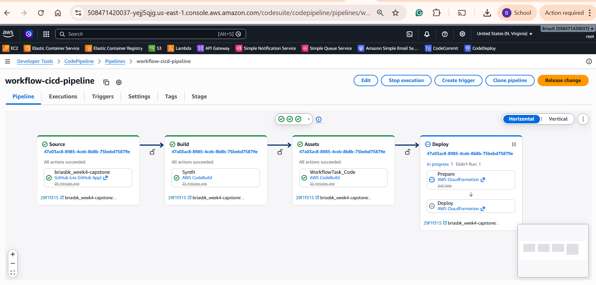
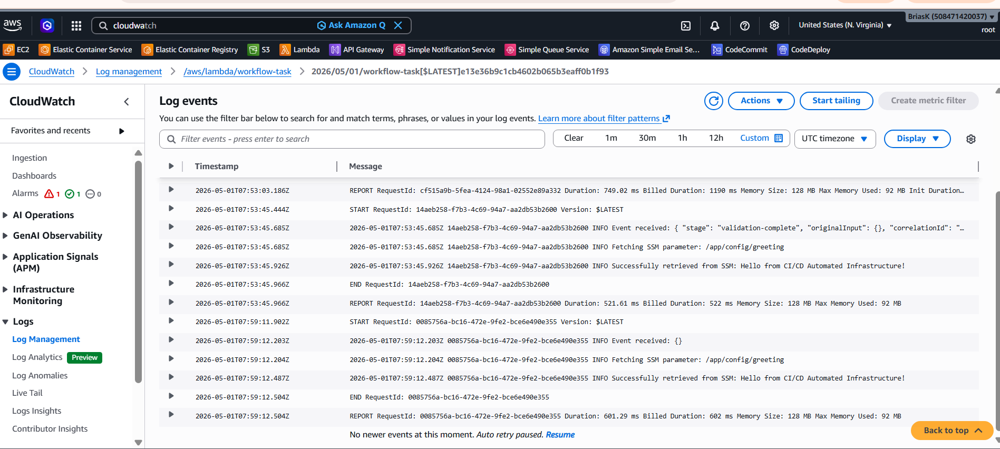

# Capstone: Advanced IaC & Automated Workflows

A fully automated, serverless cloud platform built with **AWS CDK**, **Step Functions**, **Lambda**, **SSM Parameter Store**, and **CodePipeline** — deployed end-to-end from a single `git push`.

---

## Architecture Overview


### Services Used

| Service | Role |
|---|---|
| **AWS CDK (TypeScript)** | Infrastructure as Code — defines all resources |
| **CDK Pipelines / CodePipeline** | CI/CD automation — deploys on every `git push` |
| **CodeBuild** | Builds and synths the CDK app |
| **SSM Parameter Store** | Dynamic runtime configuration (`/app/config/greeting`) |
| **AWS Lambda (Node.js 18)** | Serverless compute — retrieves SSM value at runtime |
| **AWS Step Functions** | Workflow orchestrator with 3 states + error handling |
| **CloudWatch Logs** | Observability for both Lambda and Step Functions |
| **IAM** | Least-privilege role granting Lambda `ssm:GetParameter` only |

---

## Repository Structure

```
.
├── bin/
│   └── app.ts                  # CDK app entrypoint — instantiates PipelineStack
├── lib/
│   ├── pipeline-stack.ts       # CDK Pipelines: CodePipeline + CodeBuild CI/CD
│   └── workflow-stack.ts       # SSM + Lambda + Step Functions resources
├── lambda/
│   └── index.js                # Lambda handler — reads SSM at runtime
├── cdk.json                    # CDK configuration & feature flags
├── package.json
├── tsconfig.json
└── README.md
```

---

## Prerequisites

| Tool | Version | Install |
|---|---|---|
| Node.js | ≥ 18 | https://nodejs.org |
| AWS CLI | ≥ 2 | https://aws.amazon.com/cli/ |
| AWS CDK CLI | ≥ 2.150 | `npm install -g aws-cdk` |
| AWS Account | — | With programmatic access configured |

---

## Step-by-Step Deployment Guide

### Step 1 — Clone & Install

```bash
git clone https://github.com/briasbk/week4-capstone.git
cd week4-capstone
npm install
```

### Step 2 — Configure AWS CLI

```bash
aws configure
# Enter: AWS Access Key ID, Secret Access Key, Region (e.g. us-east-1), output format (json)
```

Verify:
```bash
aws sts get-caller-identity
```

### Step 3 — Bootstrap CDK

CDK bootstrapping provisions an S3 bucket and IAM roles used during deployments. Run **once per account/region**:

```bash
cdk bootstrap aws://5/us-east-1
```

### Step 4 — Connect GitHub to AWS

1. In the AWS Console, go to **CodePipeline → Settings → Connections**
2. Click **Create connection**, choose **GitHub**, and follow the OAuth flow
3. Copy the Connection ARN (format: `arn:aws:codeconnections:us-east-1:...`)
4. Open `lib/pipeline-stack.ts` and replace the three placeholder values:
   - `YOUR_GITHUB_USERNAME/YOUR_REPO_NAME`
   - `YOUR_ACCOUNT_ID`
   - `YOUR_CONNECTION_ID`

### Step 5 — Deploy the Pipeline Stack

This single command deploys the self-mutating pipeline. After this, every `git push` to `main` will automatically re-deploy.

```bash
cdk deploy WorkflowPipelineStack
```

### Step 6 — Push Code to Trigger the Pipeline

```bash
git add .
git commit -m "feat: initial capstone deployment"
git push origin main
```

Watch the pipeline run in **AWS Console → CodePipeline → workflow-cicd-pipeline**.

### Step 7 — Manually Execute the State Machine

Once the pipeline finishes deploying the WorkflowStack:

1. Go to **AWS Console → Step Functions → State machines**
2. Click **workflow-state-machine**
3. Click **Start execution**
4. Use the default input `{}` and click **Start execution**
5. Watch the visual graph — all states should turn green

---

## Evidence of Deployment

### Screenshot 1 — Successful CodePipeline Execution

> Shows all pipeline stages (Source → Build → Deploy) completed successfully.



---

### Screenshot 2 — Step Functions Visual Execution Graph

> Shows the state machine execution with all states (Validate Input → Wait For Ready → Invoke Lambda → Succeed) highlighted green.


---

### Screenshot 3 — CloudWatch Logs: Lambda SSM Retrieval

> Shows Lambda CloudWatch logs confirming successful retrieval of the SSM parameter value.



---

## Key Design Decisions

### Least-Privilege IAM
The Lambda function's execution role is granted **only** `ssm:GetParameter` on the specific parameter path `/app/config/greeting` — nothing more. This is enforced by CDK's `configParam.grantRead(workflowLambda)` which scopes the policy to the exact resource ARN.

### Step Functions State Design (3 States)

| State | Type | Purpose |
|---|---|---|
| **Validate Input** | Pass | Enriches the payload — adds a UUID correlation ID and stage metadata before processing begins |
| **Wait For Ready** | Wait | Simulates an async readiness check; demonstrates the Wait state type |
| **Invoke Workflow Lambda** | Task | Calls the Lambda function with **2 retries** (exponential backoff) and a **Catch** block routing failures to a Fail terminal state |

### Self-Mutating Pipeline
CDK Pipelines' `selfMutation: true` means if you update `pipeline-stack.ts`, the pipeline will update itself before deploying the app — no manual `cdk deploy` needed after the first bootstrap.

### Runtime Configuration via SSM
The Lambda reads `SSM_PARAM_NAME` from its environment variable, which is set to the CDK-managed parameter name. This decouples the Lambda code from hardcoded config values — the SSM value can be updated in the console without redeploying.

---

## Testing the Lambda Locally

You can invoke the Lambda directly (without Step Functions) via the CLI:

```bash
aws lambda invoke \
  --function-name workflow-task \
  --payload '{}' \
  --cli-binary-format raw-in-base64-out \
  response.json

cat response.json
# Expected: {"status":"Success","parameterName":"/app/config/greeting","greeting":"Hello from CI/CD Automated Infrastructure!","timestamp":"..."}
```

## Updating the SSM Parameter Value

```bash
aws ssm put-parameter \
  --name "/app/config/greeting" \
  --value "Updated greeting — no redeploy needed!" \
  --overwrite
```

Re-run the Step Functions execution — the Lambda will pick up the new value instantly.

---

## Teardown

```bash
cdk destroy --all
```

> Note: CloudWatch Log Groups are set to `RemovalPolicy.DESTROY` and will be deleted automatically.